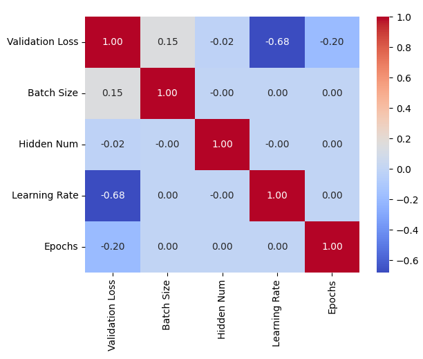
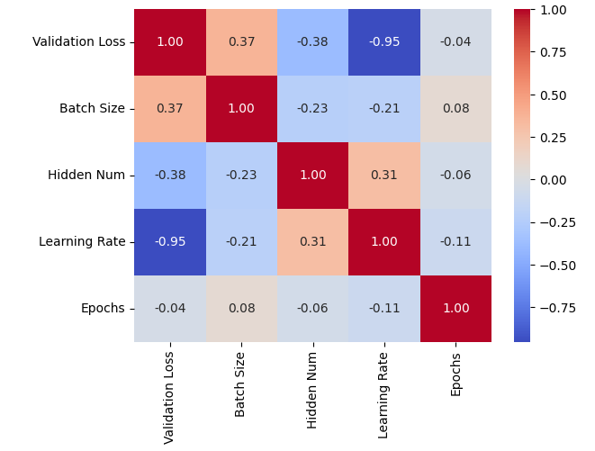

# Rapport
Arthur DESBIAUX p2006393
Valentin CUZIN RAMBAUD p2003442
## 10 septembre

Partie 1:
    Parmit les différents tensor nous avons :

        - poids(w) : [784, 10] => 784 est le nombre de pixel de l'image que l'on possède (nombre d'entrée du percetron) et 10 est le nombre de sortie.

        - biais(b) : [1, 10] => 1 chiffre qui sera le biais ajouté lors du calcul de la sortie du neuronne et 10 est le nombre de sortie.

        - data_test : [7000, 784] => 7000 le nombre d'image total de test et 784 le nombre de pixel de chaque image.

        - data_train : [63000, 784] => 63000 le nombre d'image total d'entrainement et 784 le nombre de pixel de chaque image.

        - label_test : [7000, 10] => 7000 le nombre d'image total de test et 10 est le nombre de sortie.

        - label_train : [63000, 10] => 63000 le nombre d'image total de test et 10 est le nombre de sortie.

        - x : [5, 784] => 5 car c'est la taille du batch size et 784 est  le nombre de pixel de l'image.

        - y : [5, 10] => on fait le produit scalaires de deux matrices (x et w) on se retrouve donc avec 1 sorties par neuronne. Nous avons 10 neuronnes et nous prenons 5 images donc 5x10. 

        - t : [5, 10] => Pour les 5 images on regarde le label en 10 sorties.

        - grad : [5, 10] => On soustrait deux matrices de taille 5x10, on se retrouve donc avec une matrice de taille 5x10.

        partie test :

        - x : [1, 784] =>  1 car dans la partie test on veut voir une image et 784 est le nombre de pixel de l'image.

        - y : [1, 10] => on fait le produit scalaires de deux matrices (x et w) on se retrouve donc avec 1 sorties par neuronne. Nous avons 10 neuronnes et nous prenons 1 image donc 1x10. 

        - t : [1, 10] => Pour l'image on regarde le label en 10 sorties.

        - acc : [1] => On compte le nombre de bonne réponse.
## 12 septembre
Partie 2 :

Détail méthodologie : On a écrit une classe ShallowNet étendu de nn.Module que l'on initialise avec une couche cachée contenant $N$ neurones, et une couche de sortie contenant 10 neurones de sorties (par rapport au label de sortie codé sur 10). 

Dans la méthodes forward, on implémente la logique du réseau, à savoir : couche caché => fonction d'activation relu => couche de sortie. le neurone fait une somme pondéré de ses entrées. 

Le poid de chaque entré est initialisé aléatoirement. On charge la données en découpant en 3 parties: train, validation puis test. Le jeu de données validation a été construit à partir de celui de train (on split le jeu en 2, 80% pour train et 20% pour validation).

On entraine le modèle de façon itérative sur un échantillon $X$ mini-batch de train, $K$ neuronnes dans la couche cachée, un learning rate $L$ et $Y$ epochs. A la fin d'une epoch on **retient le dernier modèle** avec son erreur calculer sur le jeu de validation. Cela nous permet de retenir des modèles qui varient en fonction des hyper-paramètres suivant : taille du batch, nombre d'epoch, nombre de neurones pour la couche cachée, taux d'apprentissage.

Pour finir on retient le meilleur modèle pour l'envoyer au test, et mesurer le taux de réussite de sa prédiction.


Pour l'hyper paramètrage nous avons mit : 
```
batch_size [3, 5, 10]
hidden_num [150, 200, 250, 300]
eta [0.00001, 0.0001, 0.001, 0.01]
nb_epochs [5, 10, 20]
```
Nos meilleurs paramètres sont :
batch size = 3, nombre de neurones pour la couche cachée = 300, taux d'apprentissage = 0.01 et nombre d'epoch = 20
Pour un score de **0.9807**. 

Une trace des tests effectués avec chaque paramètre est disponible dans **data.csv**


Nous avons calculer la corrélation entre chaque paramètre, comme on peut le voir le paramètre le plus important est le learning rate.



On peut remarquer l'importance du learning rate notamment : 

|Validation Loss|Batch Size|Hidden Num|Learning Rate|Epochs|
|---------------|----------|----------|-------------|------|
|0.09179344028234482|3|150|1e-05|5|
|0.0533987320959568|3|150|0.0001|5|
|0.025701027363538742|3|150|0.001|5|
|0.012341232970356941|3|150|0.01|5|


Sur ces 3 exemples on peut voir la validation loss descendre énormement a chaque fois. L'augmenter va permettre donc de converger mais cependant il ne faut pas le mettre trop haut sinon l'effet sera inverse.

Maintenant le nombre de neuronnes dans la couche cachée :

|Validation Loss|Batch Size|Hidden Num|Learning Rate|Epochs|
|---------------|----------|----------|-------------|------|
|0.012341232970356941|3|150|0.01|5|
|0.012302754446864128|3|200|0.01|5|
|0.011891470290720463|3|250|0.01|5|
|0.011730164289474487|3|300|0.01|5|

On voit ici une légère augmentation entre 200 et 250 neuronnes. Alors que entre 150 et 200 il y avait une augmentation mais plus légére.

Pour le nombre d'epoch :
|Validation Loss|Batch Size|Hidden Num|Learning Rate|Epochs|
|---------------|----------|----------|-------------|------|
|0.011730164289474487|3|300|0.01|5|
|0.00953193474560976|3|300|0.01|10|
|0.008148823864758015|3|300|0.01|20|

On voit une bonne augmentation tant qu'on augmente le nombre d'epochs.

Finalement la taille du batch :
|Validation Loss|Batch Size|Hidden Num|Learning Rate|Epochs|
|---------------|----------|----------|-------------|------|
|0.008148823864758015|3|300|0.01|20|
|0.009015226736664772|5|300|0.01|20|
|0.01074074488133192|10|300|0.01|20|

Comme on le peut le remarquer trop l'augmenter nous fait augmenter la perte. 

Par la suite nous avons voulu tester avec de nouveaux paramètre (en prenant en compte les meilleurs paramètres de notre dernier test) et avons décider d'appliquer un early stopping pour le nombre d'epoch :

```
batch size : [1,3,5]
nombre de neuronnes couche cachée : [250, 350, 500, 600]
learning rate : [0.005, .05, .01]
```
Les meilleurs paramètre que nous avons eu sont :  batch size 1, nombre de neuronnes couche cachée 600 learning rate 0.01 et early stop a arreté le nombre d'epoch a 6
Le taux pour un score de **0.9850**


(Seul les nouvelles donnée ont étaient utilisé)

On peut voir que la correlation a nettement augmenter pour le batch size, hidden_num et Learning rate.

Un paramètre qui pourrait potentiellement intéressant de continuer a monter serait le nombre de neuronnes dans la couche cachée.
|Validation Loss|Batch Size|Hidden Num|Learning Rate|Epochs|
|---------------|----------|----------|-------------|------|
|0.007044011261314154|1|250|0.01|6|
|0.006845048628747463|1|350|0.01|6|
|0.006447544787079096|1|500|0.01|6|
|0.0064147827215492725|1|600|0.01|6|

Comme on peut le voir ici on voit une différence entre 350 et 500 mais cette différence est moins importante entre 500 et 600. Il serait intéressant de comparer cela a des valeurs allant bien au dela par exemple [600, 1200, 1500]


Par la suite:
1. Faut voir TensorBoard, afin de comprendre l'influance des divers hyper-paramètres.
3. La bibliothèque ray Tune, pour cette argument suivant : " includes the latest hyperparameter search algorithms, integrates with TensorBoard and other analysis libraries, and natively supports distributed training".


